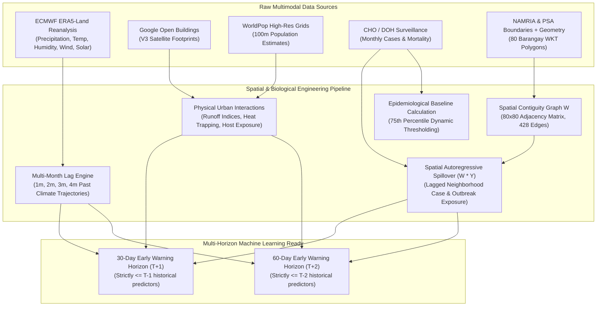

# Cagayan de Oro City Dengue Surveillance Dataset: Comprehensive Data Dictionary & Feature Engineering Guide

> **Dataset Filename**: [`cchain_cdo_dengue_surveillance_ready.csv`](file:///c:/Users/manda/OneDrive/Documents/3rd%20YEAR%20PROJ/Climate-Driven%20Vector-Borne%20Outbreak%20Surveillance/data/processed/cchain_cdo_dengue_surveillance_ready.csv)  
> **Dimensions**: $18,880\text{ rows} \times 59\text{ columns}$  
> **Spatio-Temporal Granularity**: Barangay-level monthly panel ($80\text{ Barangays} \times 236\text{ Months}$, August 2003 – December 2022)  
> **Class Balance (`is_outbreak`)**: Normal ($0$): $17,944\text{ (95.05\%)}$, Outbreak ($1$): $936\text{ (4.95\%)}$  
> **Total Surveillance Cases**: $15,560\text{ Dengue Cases}$ recorded across 20 years

---

## 1. System Architecture & Multimodal Data Lineage

---

## 2. Feature Category Breakdown (59 Features)

### 🗺️ Category A: Spatial Geometry & Identifiers (9 Features)
* `adm4_pcode` (Primary spatial key), `date` (Primary time key), `adm1_en`, `adm2_en`, `adm3_pcode`, `adm3_en`, `adm4_en`, `brgy_total_area` ($\text{km}^2$), `brgy_is_coastal` (Binary coastal flag).

### 🌦️ Category B: Ambient Meteorology at Month $T$ (9 Features)
* `pr_monthly_total_mm`, `tave_monthly_mean_c`, `tmin_monthly_mean_c`, `tmax_monthly_mean_c`, `heat_index_monthly_mean_c`, `heat_index_monthly_max_c`, `rh_monthly_mean_pct`, `wind_speed_monthly_mean`, `solar_rad_monthly_mean`.

### 🏥 Category C: Epidemiological Surveillance Targets (2 Features)
* `dengue_cases` (Monthly case count), `dengue_deaths` (Monthly mortality).

### 🏢 Category D: Urban Built-Environment & Demographics (6 Features)
* `google_bldgs_count`, `google_bldgs_density`, `google_bldgs_pct_built_up_area`, `google_bldgs_area_mean`, `pop_count_total`, `pop_density_imputed` ($\text{pop\_count\_total} / \text{brgy\_total\_area}$).

### ⏳ Category E: Multi-Month Atmospheric Lags & Moving Averages (18 Features)
* **Precipitation**: `pr_total_mm_lag_1m`, `pr_total_mm_lag_2m`, `pr_total_mm_lag_3m`, `pr_total_mm_lag_4m`, `pr_rolling_3m_lag1m`, `pr_rolling_3m_lag2m`.
* **Heat Index**: `heat_index_mean_lag_1m`, `heat_index_mean_lag_2m`, `heat_index_mean_lag_3m`, `heat_index_mean_lag_4m`.
* **Mean Temperature**: `tave_mean_lag_1m`, `tave_mean_lag_2m`, `tave_mean_lag_3m`, `tave_mean_lag_4m`.
* **Relative Humidity**: `rh_mean_lag_1m`, `rh_mean_lag_2m`, `rh_mean_lag_3m`, `rh_mean_lag_4m`.

### 🏙️ Category F: Urban-Climate Physical Interactions (5 Features)
* `runoff_risk_lag1m` ($\text{built\_up\_area} \times \text{pr\_lag\_1m}$)
* `runoff_risk_lag2m` ($\text{built\_up\_area} \times \text{pr\_lag\_2m}$)
* `urban_heat_trap_lag1m` ($\text{building\_density} \times \text{heat\_index\_lag\_1m}$)
* `urban_heat_trap_lag2m` ($\text{building\_density} \times \text{heat\_index\_lag\_2m}$)
* `host_exposure_index` ($\text{pop\_density\_imputed} \times \text{built\_up\_area}$)

### 🔄 Category G: Autoregressive & Spatial Neighborhood Lags (8 Features)
* **Autoregressive Barangay History**: `dengue_cases_lag_1m`, `dengue_cases_lag_2m`, `is_outbreak_lag_1m`, `is_outbreak_lag_2m`.
* **Spatial Contiguity Spillover ($W \cdot Y$)**: `spatial_lag_cases_1m`, `spatial_lag_cases_2m`, `spatial_lag_outbreak_1m`, `spatial_lag_outbreak_2m`.

### 🎯 Category H: Outbreak Threshold & Classification Target (2 Features)
* `brgy_p75_threshold` (Dynamic 75th percentile baseline, min 5 cases).
* `is_outbreak` (Binary target: `dengue_cases >= brgy_p75_threshold`).

---

## 3. Operational Forecasting Horizons

### 30-Day Early Warning ($T+1$)
* **Predictor Constraint**: Only features known at $\le T-1$.
* **Key Features**: 1m/2m/3m climate lags, 1m spatial spillover, urban morphology, host exposure index.
* **Top Performance**: **0.7914 PR-AUC**, **0.9605 ROC-AUC**, **91.30% Recall** at $F_2$-optimal threshold.

### 60-Day Early Warning ($T+2$)
* **Predictor Constraint**: Only features known at $\le T-2$.
* **Key Features**: 2m/3m/4m climate lags, 2m spatial spillover, urban morphology, host exposure index.
* **Top Performance**: **0.7554 PR-AUC**, **0.9537 ROC-AUC**, **73.46% to 91.51% Recall** at $F_2$-optimal threshold.
