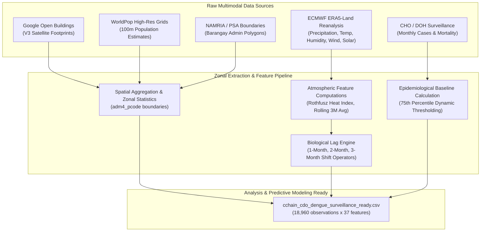
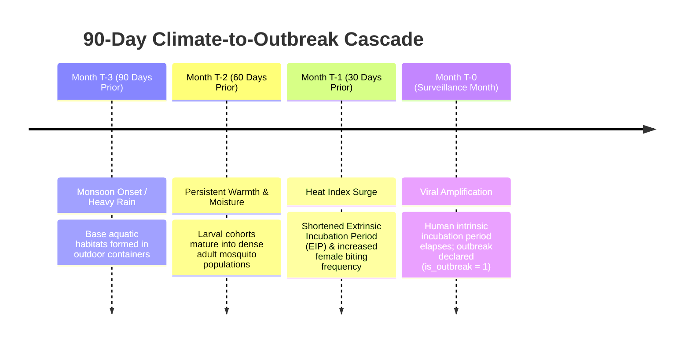

# Cagayan de Oro City Dengue Surveillance Dataset: Comprehensive Data Dictionary & Feature Engineering Guide

> **Dataset Filename**: [`cchain_cdo_dengue_surveillance_ready.csv`](file:///c:/Users/manda/OneDrive/Documents/3rd%20YEAR%20PROJ/Climate-Driven%20Vector-Borne%20Outbreak%20Surveillance/data/processed/cchain_cdo_dengue_surveillance_ready.csv)  
> **Dimensions**: $18,960\text{ rows} \times 37\text{ columns}$  
> **Spatio-Temporal Granularity**: Barangay-level monthly panel ($80\text{ Barangays} \times 237\text{ Months}$, April 2003 – December 2022)  
> **Class Balance (`is_outbreak`)**: Normal ($0$): $18,024\text{ (95.06\%)}$, Outbreak ($1$): $936\text{ (4.94\%)}$  
> **Total Surveillance Cases**: $15,560\text{ Dengue Cases}$ recorded across 20 years

---

## 1. System Architecture & Multimodal Data Lineage

---

## 2. Biological Lag Mechanism (*Aedes aegypti* Ecology)

Vector-borne transmission exhibits non-linear temporal delays because climate drivers do not trigger immediate clinical hospitalizations. The dataset explicitly incorporates **1-month, 2-month, and 3-month lagged climate features**:

---

## 3. Comprehensive Feature Dictionary

### 🗺️ Category A: Spatial Master Identifiers & Geometry (8 Features)

| # | Feature Name | Data Type | Null Count | Sample Value | Valid Range / Cardinality | Description & Operational Use |
|---|---|---|---|---|---|---|
| 1 | `adm4_pcode` | `String` | 0 | `PH104305001` | 80 Unique Pcodes | **Primary Spatial Key**: PSA Standard Geographic Code for the Barangay. |
| 2 | `date` | `Date / String` | 0 | `2003-04-01` | 2003-04-01 to 2022-12-01 | **Primary Temporal Key**: Surveillance timestamp (First day of month). |
| 3 | `adm1_en` | `String` | 0 | `Region X` | Constant (`Region X`) | Administrative Region Name (Northern Mindanao). |
| 4 | `adm2_en` | `String` | 0 | `Misamis Oriental` | Constant (`Misamis Oriental`) | Administrative Province Name. |
| 5 | `adm3_pcode` | `String` | 0 | `PH104305000` | Constant (`PH104305000`) | City / LGU PSA Code for Cagayan de Oro City. |
| 6 | `adm3_en` | `String` | 0 | `Cagayan de Oro City` | Constant (`Cagayan de Oro City`) | City Name. |
| 7 | `adm4_en` | `String` | 0 | `Agusan` | 80 Unique Barangay Names | Local Barangay Name (e.g., *Carmen*, *Lapasan*, *Balulang*, *Macasandig*). |
| 8 | `brgy_total_area` | `Float64` | 0 | `6.2792` | $[0.02, 62.12]\text{ km}^2$ | Geographic surface area of the barangay polygon. Used to compute density metrics. |

---

### 🌦️ Category B: Ambient Climate & Meteorology (9 Features)

*Derived from ECMWF ERA5-Land Reanalysis using spatial zonal means over barangay polygons.*

| # | Feature Name | Data Type | Units | Range | Epidemiological Meaning & Ecological Mechanism |
|---|---|---|---|---|---|
| 9 | `pr_monthly_total_mm` | `Float64` | $\text{mm}$ | $[6.29, 577.78]$ | **Accumulated Precipitation**: Total rainfall. Drives temporary outdoor standing water pools and flushed drainage channels. |
| 10 | `tave_monthly_mean_c` | `Float64` | $^\circ\text{C}$ | $[23.60, 27.88]$ | **Mean Ambient Temperature**: 2-meter air temperature. Regulates *Aedes* egg incubation and larval development speeds. |
| 11 | `tmin_monthly_mean_c` | `Float64` | $^\circ\text{C}$ | $[20.69, 26.24]$ | **Mean Minimum Temperature**: Nighttime thermal minimum floor. Dictates overnight mosquito survival and lowest threshold for viral replication. |
| 12 | `tmax_monthly_mean_c` | `Float64` | $^\circ\text{C}$ | $[25.87, 31.20]$ | **Mean Maximum Temperature**: Daytime thermal ceiling. Temperatures exceeding $35^\circ\text{C}$ inhibit mosquito activity, while $28\text{--}32^\circ\text{C}$ is optimal. |
| 13 | `heat_index_monthly_mean_c` | `Float64` | $^\circ\text{C}$ | $[24.59, 31.52]$ | **Mean Heat Index**: Apparent temperature calculated via the Rothfusz regression equation. Direct proxy for the **Extrinsic Incubation Period (EIP)** of the virus. |
| 14 | `heat_index_monthly_max_c` | `Float64` | $^\circ\text{C}$ | $[27.14, 33.12]$ | **Peak Heat Index**: Monthly thermal extreme spike recorded within the barangay. |
| 15 | `rh_monthly_mean_pct` | `Float64` | $\%$ | $[69.92, 89.73]$ | **Relative Humidity**: Moisture content. High humidity ($>75\%$) prevents adult mosquito desiccation, extending lifespan and increasing lifetime bite count. |
| 16 | `wind_speed_monthly_mean` | `Float64` | $\text{m/s}$ | $[0.20, 2.88]$ | **Mean Wind Speed**: Calmer winds ($<1.5\text{ m/s}$) facilitate mosquito flight, host odor plume tracking, and oviposition. |
| 17 | `solar_rad_monthly_mean` | `Float64` | $\text{W/m}^2$ | $[124.69, 279.93]$ | **Surface Solar Radiation**: Direct sunlight exposure influencing water temperature in breeding receptacles and algae/microbial larval nutrition. |

---

### 🏥 Category C: Epidemiological Surveillance Ground Truth (2 Features)

| # | Feature Name | Data Type | Units | Range | Description & Operational Handling |
|---|---|---|---|---|---|
| 18 | `dengue_cases` | `Int64` | Cases | $[0, 126]$ | **Recorded Dengue Case Count**: Total monthly confirmed/suspected dengue clinical cases per barangay. Mean: $0.82\text{ cases/month}$; Max: $126$ in Carmen. |
| 19 | `dengue_deaths` | `Int64` | Deaths | $[0, 0]$ | **Dengue Fatalities**: Mortality metric. (All zeroes in current reporting slice). |

---

### 🏢 Category D: Urban Built-Environment Morphology (4 Features)

*Derived from Google Open Buildings V3 satellite segmentation.*

| # | Feature Name | Data Type | Units | Range | Epidemiological Meaning & Ecological Mechanism |
|---|---|---|---|---|---|
| 20 | `google_bldgs_count` | `Float64` | Count | $[26, 22,984]$ | **Building Structure Count**: Total satellite-detected buildings. Differentiates compact residential settlements from open rural land. |
| 21 | `google_bldgs_density` | `Float64` | $\text{Bldgs/m}^2$ | $[0.00001, 0.0075]$ | **Spatial Building Density**: Number of buildings divided by barangay area. High density indicates close proximity of human breeding habitats. |
| 22 | `google_bldgs_pct_built_up_area` | `Float64` | $\%$ | $[0.09, 76.45]$ | **Built-Up Surface Fraction**: Impervious surface coverage percentage. Creates micro-urban heat islands and artificial drainage runoff containers. |
| 23 | `google_bldgs_area_mean` | `Float64` | $\text{m}^2$ | $[41.01, 691.90]$ | **Average Building Footprint**: Smaller mean footprints ($\approx 50\text{--}80\text{ m}^2$) characterize high-density residential subdivisions; larger footprints indicate commercial/warehousing zones. |

---

### 👥 Category E: Demographics & Human Host Density (2 Features)

*Derived from WorldPop Global High-Resolution Spatial Demographics.*

| # | Feature Name | Data Type | Units | Range | Nulls | Epidemiological Meaning & Operational Notes |
|---|---|---|---|---|---|---|
| 24 | `pop_count_total` | `Float64` | Persons | $[25.86, 96,229.3]$ | 0 | **Estimated Population**: Total resident population in the barangay. Acts as the available susceptible human host reservoir. |
| 25 | `pop_density_mean` | `Float64` | $\text{Persons/km}^2$ | $[55.01, 28,048.8]$ | 9,006 | **Mean Population Density**: Host concentration metric. High density enables explosive rapid human-to-mosquito-to-human transmission chains. |

> [!NOTE]
> **Imputation Guidance for `pop_density_mean`**:  
> If using `pop_density_mean` in ML models, impute the 9,006 missing entries directly using the deterministic mathematical identity:  
> $$\text{pop\_density\_imputed} = \frac{\text{pop\_count\_total}}{\text{brgy\_total\_area}}$$

---

### ⏳ Category F: Temporal Climate Lags & Moving Window Aggregates (10 Features)

| # | Feature Name | Data Type | Units | Range | Temporal Offset | Biological Justification |
|---|---|---|---|---|---|---|
| 26 | `pr_total_mm_lag_1m` | `Float64` | $\text{mm}$ | $[6.29, 577.78]$ | $T - 1\text{ month}$ | Captures direct breeding habitat flooding and pupae maturation immediately prior to case reporting. |
| 27 | `heat_index_mean_lag_1m` | `Float64` | $^\circ\text{C}$ | $[24.59, 31.52]$ | $T - 1\text{ month}$ | Modulates viral incubation (EIP) and biting frequency during active transmission. |
| 28 | `tave_mean_lag_1m` | `Float64` | $^\circ\text{C}$ | $[23.60, 27.88]$ | $T - 1\text{ month}$ | Immediate preceding temperature regime. |
| 29 | `pr_total_mm_lag_2m` | `Float64` | $\text{mm}$ | $[6.29, 577.78]$ | $T - 2\text{ months}$ | Reflects precipitation that established initial oviposition and egg hydration 60 days prior. |
| 30 | `heat_index_mean_lag_2m` | `Float64` | $^\circ\text{C}$ | $[24.59, 31.52]$ | $T - 2\text{ months}$ | Historical warmth driving rapid generation cycles of early vector populations. |
| 31 | `tave_mean_lag_2m` | `Float64` | $^\circ\text{C}$ | $[23.60, 27.88]$ | $T - 2\text{ months}$ | Two-month baseline temperature. |
| 32 | `pr_total_mm_lag_3m` | `Float64` | $\text{mm}$ | $[6.29, 577.78]$ | $T - 3\text{ months}$ | Seasonal monsoon transition indicator setting long-term environmental carrying capacity. |
| 33 | `heat_index_mean_lag_3m` | `Float64` | $^\circ\text{C}$ | $[24.59, 31.52]$ | $T - 3\text{ months}$ | Long-term thermal accumulation preceding epidemic wave formation. |
| 34 | `tave_mean_lag_3m` | `Float64` | $^\circ\text{C}$ | $[23.60, 27.88]$ | $T - 3\text{ months}$ | Three-month baseline temperature. |
| 35 | `pr_rolling_3m_avg` | `Float64` | $\text{mm}$ | $[16.16, 470.91]$ | Moving window | **3-Month Rolling Average Rainfall**: $\frac{PR_{T} + PR_{T-1} + PR_{T-2}}{3}$. Filters out isolated erratic downpours to measure sustained wet/dry hydrological conditions. |

---

### 🎯 Category G: Epidemic Thresholds & Machine Learning Classification Targets (2 Features)

| # | Feature Name | Data Type | Units / Values | Range | Role in Machine Learning Modeling |
|---|---|---|---|---|---|
| 36 | `brgy_p75_threshold` | `Float64` | Cases | $[5.00, 9.25]$ | **Dynamic Baseline Baseline**: The 75th percentile of historical dengue cases in that specific barangay (constrained by a minimum safety floor of $5\text{ cases}$). Accounts for the fact that a large barangay (e.g., Carmen, pop $\sim 96\text{k}$) naturally records higher case counts than an upland barangay (e.g., Tignapoloan). |
| 37 | `is_outbreak` | `Int64` | Binary (`0` or `1`) | $0\text{ or }1$ | **Primary Binary Supervised Target Variable ($Y$)**: • `1` (**Outbreak Alert**): $\text{dengue\_cases} \ge \text{brgy\_p75\_threshold}$ ($N=936$ rows, $4.94\%$) • `0` (**Normal / Endemic**): $\text{dengue\_cases} < \text{brgy\_p75\_threshold}$ ($N=18,024$ rows, $95.06\%$). |

---

## 4. Machine Learning & Modeling Best Practices

> [!IMPORTANT]
> **Preventing Data Leakage**:  
> When training predictive models to forecast outbreaks at time $T$:
> 1. **Do NOT include** `dengue_cases`, `dengue_deaths`, or `brgy_p75_threshold` as input features ($X$), as `is_outbreak` is mathematically defined from them.
> 2. **Evaluation Protocol**: Use **Temporal Time-Series Split** (e.g., Train on 2003–2017, Validate on 2018–2019, Test on 2020–2022) or **Spatial GroupKFold** on `adm4_pcode` to ensure true out-of-sample and out-of-barangay generalization.
> 3. **Imbalance Handling**: Apply PR-AUC (Precision-Recall Area Under Curve), F1-Macro, or Brier Score rather than standard Accuracy due to the $4.94\%$ positive outbreak incidence.
