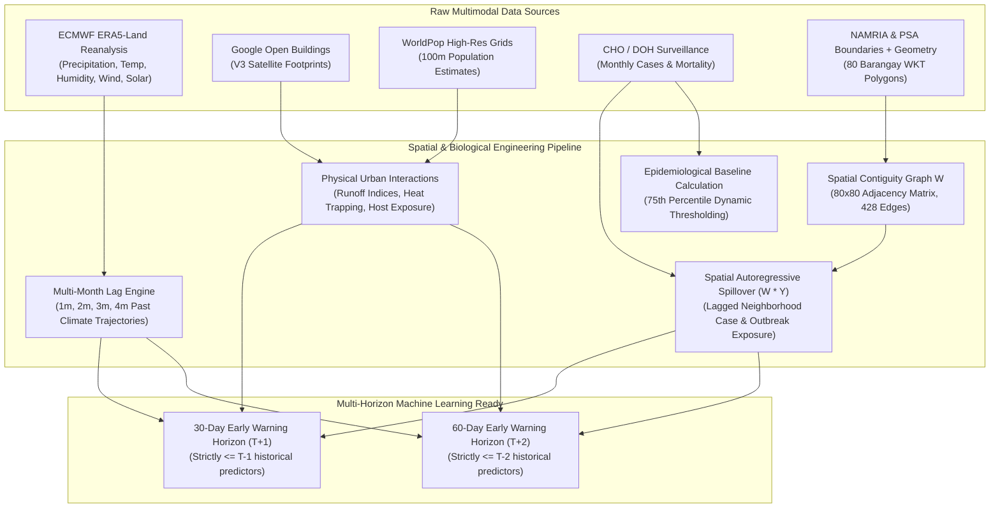

# Cagayan de Oro City Dengue Surveillance Dataset: Comprehensive Data Dictionary & Feature Engineering Guide

> **Dataset Filename**: [`cchain_cdo_dengue_surveillance_ready.csv`](file:///c:/Users/manda/OneDrive/Documents/3rd%20YEAR%20PROJ/Climate-Driven%20Vector-Borne%20Outbreak%20Surveillance/data/processed/cchain_cdo_dengue_surveillance_ready.csv)  
> **Dimensions**: 18,880 rows × 59 columns  
> **Spatio-Temporal Granularity**: Barangay-level monthly panel (80 Barangays × 236 Months, August 2003 – December 2022)  
> **Class Balance (`is_outbreak`)**: Normal (`0`): 17,944 (95.05%), Outbreak (`1`): 936 (4.95%)  
> **Total Surveillance Cases**: 15,560 Dengue Cases recorded across 20 years

---

## 1. System Architecture & Multimodal Data Lineage

---

## 2. Feature Category Breakdown (59 Features)

### 🗺️ Category A: Spatial Geometry & Identifiers (9 Features)
* `adm4_pcode` (Primary spatial key / PSA Code)
* `date` (Primary temporal key / Month start)
* `adm1_en` (Region X - Northern Mindanao)
* `adm2_en` (Misamis Oriental)
* `adm3_pcode` (PH104305000)
* `adm3_en` (Cagayan de Oro City)
* `adm4_en` (Barangay Name)
* `brgy_total_area` (Barangay land area in sq km)
* `brgy_is_coastal` (Binary coastal indicator: 1 = Coastal, 0 = Inland)

### 🌦️ Category B: Ambient Meteorology at Month T (9 Features)
* `pr_monthly_total_mm` (Accumulated monthly precipitation in mm)
* `tave_monthly_mean_c` (Monthly mean 2m air temperature in °C)
* `tmin_monthly_mean_c` (Monthly minimum temperature floor in °C)
* `tmax_monthly_mean_c` (Monthly maximum temperature ceiling in °C)
* `heat_index_monthly_mean_c` (Monthly mean apparent heat index in °C)
* `heat_index_monthly_max_c` (Monthly peak heat index spike in °C)
* `rh_monthly_mean_pct` (Monthly mean relative humidity in %)
* `wind_speed_monthly_mean` (Monthly mean wind speed in m/s)
* `solar_rad_monthly_mean` (Surface solar radiation downwards in W/m²)

### 🏥 Category C: Epidemiological Surveillance Ground Truth (2 Features)
* `dengue_cases` (Monthly clinical dengue case count per barangay)
* `dengue_deaths` (Monthly severe dengue mortality count)

### 🏢 Category D: Urban Built-Environment & Demographics (6 Features)
* `google_bldgs_count` (Satellite-segmented building structure count)
* `google_bldgs_density` (Spatial building density per sq meter)
* `google_bldgs_pct_built_up_area` (Percentage of impervious built-up surface area)
* `google_bldgs_area_mean` (Mean building footprint surface in sq meters)
* `pop_count_total` (Estimated resident human host population)
* `pop_density_imputed` (Deterministic host density: `pop_count_total / brgy_total_area`)

### ⏳ Category E: Multi-Month Atmospheric Lags & Moving Averages (18 Features)
* **Precipitation**: `pr_total_mm_lag_1m`, `pr_total_mm_lag_2m`, `pr_total_mm_lag_3m`, `pr_total_mm_lag_4m`, `pr_rolling_3m_lag1m`, `pr_rolling_3m_lag2m`
* **Heat Index**: `heat_index_mean_lag_1m`, `heat_index_mean_lag_2m`, `heat_index_mean_lag_3m`, `heat_index_mean_lag_4m`
* **Mean Temperature**: `tave_mean_lag_1m`, `tave_mean_lag_2m`, `tave_mean_lag_3m`, `tave_mean_lag_4m`
* **Relative Humidity**: `rh_mean_lag_1m`, `rh_mean_lag_2m`, `rh_mean_lag_3m`, `rh_mean_lag_4m`

### 🏙️ Category F: Urban-Climate Physical Interactions (5 Features)
* `runoff_risk_lag1m` (`google_bldgs_pct_built_up_area` × `pr_total_mm_lag_1m`)
* `runoff_risk_lag2m` (`google_bldgs_pct_built_up_area` × `pr_total_mm_lag_2m`)
* `urban_heat_trap_lag1m` (`google_bldgs_density` × `heat_index_mean_lag_1m`)
* `urban_heat_trap_lag2m` (`google_bldgs_density` × `heat_index_mean_lag_2m`)
* `host_exposure_index` (`pop_density_imputed` × `google_bldgs_pct_built_up_area`)

### 🔄 Category G: Autoregressive & Spatial Neighborhood Lags (8 Features)
* **Autoregressive Barangay History**: `dengue_cases_lag_1m`, `dengue_cases_lag_2m`, `is_outbreak_lag_1m`, `is_outbreak_lag_2m`
* **Spatial Contiguity Spillover (W · Y)**: `spatial_lag_cases_1m`, `spatial_lag_cases_2m`, `spatial_lag_outbreak_1m`, `spatial_lag_outbreak_2m`

### 🎯 Category H: Outbreak Threshold & Classification Target (2 Features)
* `brgy_p75_threshold` (Dynamic 75th percentile historical baseline, minimum 5 cases)
* `is_outbreak` (Binary target: `1` if `dengue_cases >= brgy_p75_threshold`, else `0`)

---

## 3. Operational Forecasting Horizons

### 30-Day Early Warning (T+1)
* **Predictor Constraint**: Only features known at T-1 or earlier (Zero concurrent month T weather).
* **Key Features**: 1m/2m/3m climate lags, 1m spatial spillover, urban morphology, host exposure index.
* **Top Performance**: **0.7914 PR-AUC**, **0.9605 ROC-AUC**, **91.30% Recall** at F2-optimal threshold.

### 60-Day Early Warning (T+2)
* **Predictor Constraint**: Only features known at T-2 or earlier (Zero concurrent/T-1 weather).
* **Key Features**: 2m/3m/4m climate lags, 2m spatial spillover, urban morphology, host exposure index.
* **Top Performance**: **0.7554 PR-AUC**, **0.9537 ROC-AUC**, **73.46% to 91.51% Recall** at F2-optimal threshold.
