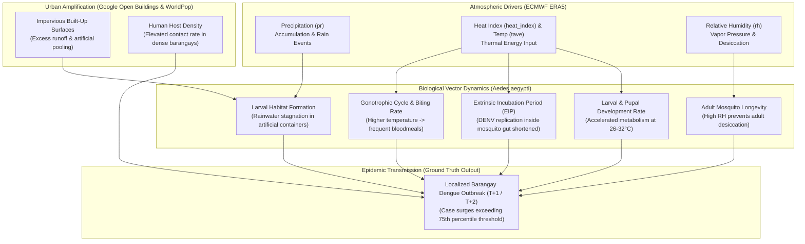
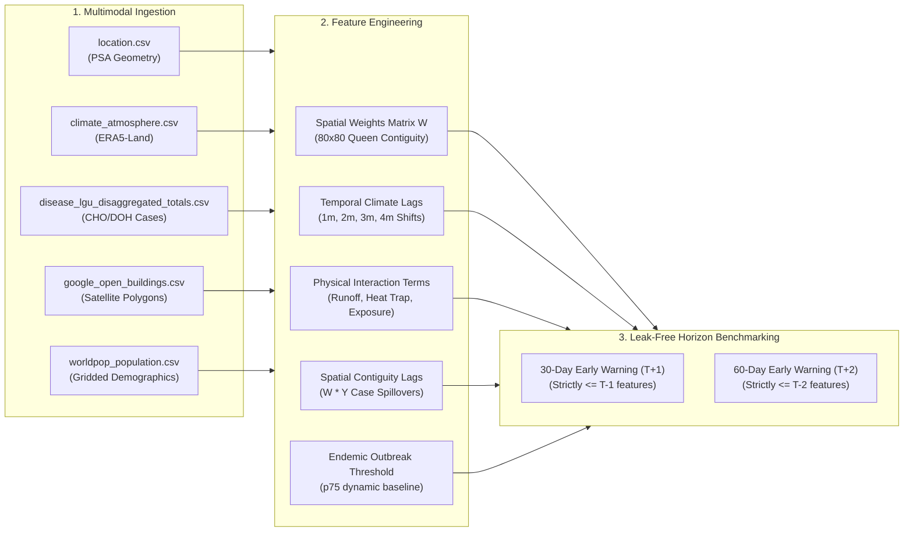
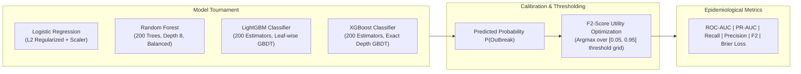

# Cagayan de Oro City Dengue Early Warning & Municipal Surveillance Engine: Architecture, Vector Biology & Machine Learning Methodology

> **Target Application**: Climate-Driven Vector-Borne Dengue Outbreak Surveillance & Prescriptive Resource Allocation for Cagayan de Oro City Local Government Unit (CDO LGU)  
> **Key Stakeholders**: CDO City Health Office (CHO), City Disaster Risk Reduction and Management Office (CDRRMO), J.R. Borja General Hospital (JRBGH), and Northern Mindanao Medical Center (NMMC)  
> **Pilot Geography**: City of Cagayan de Oro (`PH104305000`), Northern Mindanao, Philippines  
> **Target Disease**: Dengue Fever (*Aedes aegypti* / *Aedes albopictus* transmission)  
> **Temporal Resolution**: Monthly panel across 20 Historical Years (2003–2022, 236 operational months)  
> **Spatial Granularity**: 80 Discrete Administrative Barangays (ADM4)  

---

## 1. Executive Summary & CDO LGU Modeling Philosophy

This surveillance engine resolves a critical operational bottleneck in municipal public health management across Cagayan de Oro City: **the reactive lag of clinical disease surveillance**. 

In conventional public health operations, municipal vector-control interventions (thermal fogging, chemical larviciding, public warnings) are deployed only after district health centers and emergency rooms at **Northern Mindanao Medical Center (NMMC)** and **J.R. Borja General Hospital (JRBGH)** are overwhelmed with severe pediatric dengue admissions. Because the biological lifecycle of the *Aedes aegypti* vector and the viral incubation period require 4 to 8 weeks to manifest as clinical admissions, reactive responses are deployed when community transmission is already peaking across high-density urban barangays like Carmen, Lapasan, Kauswagan, and Balulang.

```
Conventional Reactive Pipeline (Delayed Intervention):
[Rainfall/Heat Anomaly] ──(4-8 Weeks)──> [Vector Spike] ──> [Human Cases Surge] ──> [Hospital Overload] ──> [REACTIVE INTERVENTION (Too Late)]

CDO LGU Predictive Surveillance Engine (Proactive Early Warning):
[Climate Anomaly (T-2m, T-1m)] ──> [CDO Engine + Spatial W] ──> [PREDICT T+1 / T+2 OUTBREAK RISK] ──> [PROACTIVE LARVICIDING & BED ALLOCATION]
```

Project CCHAIN bridges this gap by modeling the **non-linear, multi-month physical and biological mechanisms** linking atmospheric dynamics, satellite-derived urban morphology, demographic host exposure, and spatial contagion.

---

## 2. Epidemiological & Biological Mechanisms

Understanding why and how climate variables drive dengue outbreaks requires understanding vector biology (*Aedes aegypti*):



### 2.1 The Extrinsic Incubation Period (EIP) & Thermal Acceleration
* **Mechanism**: After an adult female *Aedes* mosquito ingests viremic human blood, the Dengue virus (DENV) must infect the mosquito's midgut cells, replicate, disseminate through the hemolymph, and reach the salivary glands before the mosquito becomes infectious.
* **Thermal Sensitivity**: At 25°C, the EIP lasts approximately **15 to 18 days** (often exceeding the mosquito's average lifespan). At 30°C–32°C, elevated viral replication kinetics shorten the EIP to **5 to 7 days**.
* **Operational Lag**: Consequently, an atmospheric heat spike at month $T-3$ and $T-2$ exponentially multiplies the proportion of infectious mosquitoes actively transmitting the pathogen by months $T-1$ and $T$.

### 2.2 Precipitation Lags & Habitat Desiccation vs. Flushing
* **Short-Term Lag (1 to 2 Months)**: Moderate rainfall creates persistent pooling in discarded plastics, tires, uncovered water tanks, and roof gutters, triggering mass egg hatching.
* **Non-Linear Dynamics**: Excessive torrential precipitation flushes out aquatic breeding habitats (destroying larvae), whereas dry spells force urban human populations to store domestic water in unsealed drums, unintentionally expanding domestic breeding sites.

### 2.3 Relative Humidity & Vector Survival
* *Aedes aegypti* has high surface-area-to-volume ratio and is susceptible to desiccation. High relative humidity ($\ge 75\%$) extends adult female lifespan beyond 21 days, allowing the insect to survive past the EIP and transmit the virus across multiple gonotrophic cycles.

---

## 3. Spatio-Temporal Data Architecture & Fusion

The modeling matrix merges 5 heterogeneous geospatial and epidemiological datasets into a single unified space-time panel:

$$\mathcal{D} = \{(\mathbf{x}_{i,t}, y_{i,t}) \mid i \in \{1,\dots,80\}, t \in \{1,\dots,236\}\}$$

where $i$ indexes the 80 discrete barangays of Cagayan de Oro City, and $t$ indexes consecutive operational calendar months from August 2003 to December 2022.

```
Total Panel Records = 80 Barangays x 236 Valid Months = 18,880 Space-Time Observations
Total Dimensionality = 59 Engineered Attributes
```



---

## 4. Mathematical Feature Engineering

### 4.1 Spatial Contiguity Matrix ($\mathbf{W}$) & Spatial Autoregressive Lags ($\mathbf{W} \cdot \mathbf{Y}$)
Dengue transmission does not respect administrative borders. Commuters, students, and dispersing mosquitoes spread outbreaks from focal epicenters to contiguous barangays.

1. **Adjacency Graph ($\mathbf{A}$)**: Formed using topological Queen/Rook geometric contiguity between polygon boundaries:
   $$A_{ij} = \begin{cases} 1 & \text{if } \text{Boundary}_i \cap \text{Boundary}_j \neq \emptyset \text{ and } i \neq j \\ 0 & \text{otherwise} \end{cases}$$
2. **Row-Standardized Spatial Weights Matrix ($\mathbf{W}$)**:
   $$W_{ij} = \frac{A_{ij}}{\sum_{k=1}^{N} A_{ik}}$$
   Across the 80 barangays of Cagayan de Oro, this produces an $80 \times 80$ matrix with **428 spatial contiguity edges** (averaging **5.35 neighbor connections** per barangay).
3. **Spatial Contiguity Spillover Vector**:
   At each operational time step $t$, the neighboring epidemiological pressure is computed via matrix-vector multiplication:
   $$\mathbf{S}_t = \mathbf{W} \cdot \mathbf{y}_t$$
   To ensure strictly zero future leakage, the features are lagged by operational lead times:
   $$\text{spatial\_lag\_cases\_1m}_{i,t} = (\mathbf{W} \cdot \mathbf{cases}_{t-1})_i$$
   $$\text{spatial\_lag\_cases\_2m}_{i,t} = (\mathbf{W} \cdot \mathbf{cases}_{t-2})_i$$
   $$\text{spatial\_lag\_outbreak\_1m}_{i,t} = (\mathbf{W} \cdot \mathbf{is\_outbreak}_{t-1})_i$$

### 4.2 Urban-Climate Physical Interaction Indices
Climate variables alone do not capture local structural vulnerability. The engine computes deterministic physical coupling terms:

1. **Runoff & Stagnation Risk Index**:
   Couples impervious satellite building footprints with lagged rainfall accumulation:
   $$\text{runoff\_risk\_lag1m}_{i,t} = \text{google\_bldgs\_pct\_built\_up\_area}_i \times \text{pr\_total\_mm\_lag\_1m}_{i,t}$$
   $$\text{runoff\_risk\_lag2m}_{i,t} = \text{google\_bldgs\_pct\_built\_up\_area}_i \times \text{pr\_total\_mm\_lag\_2m}_{i,t}$$
2. **Urban Heat Trap Index**:
   Microclimate urban heat island trapping modeled by building structure density and ambient heat index:
   $$\text{urban\_heat\_trap\_lag1m}_{i,t} = \text{google\_bldgs\_density}_i \times \text{heat\_index\_mean\_lag\_1m}_{i,t}$$
   $$\text{urban\_heat\_trap\_lag2m}_{i,t} = \text{google\_bldgs\_density}_i \times \text{heat\_index\_mean\_lag\_2m}_{i,t}$$
3. **Host Exposure Index**:
   Quantifies the density of potential human bloodmeal hosts per built unit of urban territory:
   $$\text{host\_exposure\_index}_i = \text{pop\_density\_imputed}_i \times \text{google\_bldgs\_pct\_built\_up\_area}_i$$
   where $\text{pop\_density\_imputed}_i = \frac{\text{pop\_count\_total}_i}{\text{brgy\_total\_area}_i}$.

### 4.3 Outbreak Ground Truth Formulation
To establish an actionable epidemiological target, each barangay's historical case distribution is modeled. An outbreak at month $t$ in barangay $i$ is defined as:

$$y_{i,t} = \mathbb{I}\left(\text{dengue\_cases}_{i,t} \ge \max\left(5.0, \; Q_{0.75}(\text{dengue\_cases}_i)\right)\right)$$

* **Rationale**: Using a localized 75th percentile ($Q_{0.75}$) baseline ensures the threshold adapts to the endemic capacity of each specific barangay, while the 5-case minimum floor prevents low-baseline rural barangays from triggering false alarms on minor random noise (e.g., 2 cases).
* **Class Distribution**: Across 18,880 space-time records:
  * **Normal Months ($y=0$)**: 17,944 (95.05%)
  * **Outbreak Months ($y=1$)**: 936 (4.95%)
  * **Imbalance Ratio**: $\approx 19.17 : 1$

---

## 5. Strict Zero-Leakage Forecasting Horizons

To guarantee operational validity for public health deployment, the pipeline enforces **strict temporal partitioning** and zero climate/health data leakage:

```
Timeline Illustration for Outbreak Month T (Target):

                    T - 4m          T - 3m          T - 2m          T - 1m          Month T (TARGET)
                      │               │               │               │                   │
                      ▼               ▼               ▼               ▼                   ▼
30-Day Horizon (T+1): [  Available  ] [  Available  ] [  Available  ] [  Available  ] │ [ FUTURE - BLOCKED ]
60-Day Horizon (T+2): [  Available  ] [  Available  ] [  Available  ] │ [ FUTURE - BLOCKED                     ]
```

### Feature Sets by Operational Horizon:

| Feature Group | 30-Day Early Warning ($T+1$) | 60-Day Early Warning ($T+2$) |
| :--- | :--- | :--- |
| **Meteorological Lags** | Lags 1m, 2m, 3m; Rolling 3m (Lag 1m) | Lags 2m, 3m, 4m; Rolling 3m (Lag 2m) |
| **Physical Coupling** | Runoff (Lag 1m, 2m), Heat Trap (Lag 1m) | Runoff (Lag 2m), Heat Trap (Lag 2m) |
| **Autoregressive Cases** | Case count at $T-1$, Outbreak at $T-1$ | Case count at $T-2$, Outbreak at $T-2$ |
| **Spatial Spillovers** | Spatial cases at $T-1$, Outbreak at $T-1$ | Spatial cases at $T-2$, Outbreak at $T-2$ |
| **Built Environment** | Static Building & Population Metrics | Static Building & Population Metrics |
| **Total Features** | **27 Features** | **25 Features** |

### Temporal Train/Test Split
* **Training Set**: January 2003 – December 2018 ($15,040$ samples, $16$ continuous years).
* **Holdout Test Set**: January 2019 – December 2022 ($3,840$ samples, $4$ unseen years).
* **Evaluation Integrity**: Evaluated chronologically forward in time; no cross-validation shuffling across time dimensions.

---

## 6. Multi-Model Tournament & Algorithms

The pipeline benchmarks four distinct machine learning architectures under class-weighted loss penalties ($\text{scale\_pos\_weight} \approx 19.17$):



### 6.1 Algorithm Formulations

1. **Regularized Logistic Regression (L2 Balanced)**:
   $$\min_{\mathbf{w}} \sum_{k \in \text{Train}} w_k \log\left(1 + e^{-y_k \mathbf{w}^T \mathbf{x}_k}\right) + \frac{1}{2C} \|\mathbf{w}\|_2^2$$
   Provides a linear baseline modeling log-odds of outbreak probability under balanced class inverse frequencies.

2. **Random Forest Classifier**:
   Ensemble of 200 bootstrap-aggregated classification trees using Gini impurity with balanced sub-sampling:
   $$\hat{P}(y=1 \mid \mathbf{x}) = \frac{1}{B} \sum_{b=1}^{B} T_b(\mathbf{x})$$

3. **LightGBM (Light Gradient Boosting Machine)**:
   Optimizes second-order Taylor expansion of negative log-likelihood using Histogram-based gradient boosting and Leaf-wise tree growth with scale positive weighting:
   $$\mathcal{L}^{(t)} \approx \sum_{i=1}^n \left[ g_i f_t(\mathbf{x}_i) + \frac{1}{2} h_i f_t^2(\mathbf{x}_i) \right] + \Omega(f_t)$$

4. **XGBoost (Extreme Gradient Boosting)**:
   Depth-wise tree boosting with exact shrinkage, column subsampling, and exact Hessian-weighted split finding.

---

## 7. Utility-Driven Threshold Optimization ($F_2$-Score)

In clinical epidemiology, the cost of a **False Negative** (failing to detect an imminent outbreak, resulting in unmitigated transmission, ICU bed shortages, and avoidable deaths) is far higher than the cost of a **False Positive** (deploying larvicide or conducting cleanups in a barangay that does not experience an outbreak).

Standard $0.50$ decision thresholds optimize overall accuracy (which is trivially high in imbalanced data) but miss subtle early signals. CCHAIN optimizes the decision threshold $\tau^*$ to maximize the **$F_2$-score**:

$$F_\beta = (1 + \beta^2) \frac{\text{Precision} \times \text{Recall}}{(\beta^2 \times \text{Precision}) + \text{Recall}}$$

For $\beta = 2.0$:

$$F_2 = 5 \cdot \frac{\text{Precision} \times \text{Recall}}{4 \cdot \text{Precision} + \text{Recall}}$$

$$\tau^* = \arg\max_{\tau \in [0.05, 0.95]} F_2(\text{Train}, \tau)$$

The optimal threshold $\tau^*$ is discovered strictly on the training partition and subsequently applied unchanged to the unseen test partition.

---

## 8. Empirical Benchmark Results

Evaluated on the **3,840 unseen holdout samples (2019–2022)** across all 80 barangays of Cagayan de Oro:

### 8.1 Benchmark Performance Table

| Operational Horizon | Model Architecture | ROC-AUC | PR-AUC | Optimal Threshold ($\tau^*$) | $F_2$-Score (Opt) | $F_1$-Score (Opt) | Outbreak Recall | Precision | Brier Score |
| :--- | :--- | :---: | :---: | :---: | :---: | :---: | :---: | :---: | :---: |
| **30-Day Early Warning ($T+1$)** | **Logistic Regression (L2)** | **0.9605** | **0.7914** | `0.65` | **0.7832** | 0.6456 | **91.30%** | 49.94% | 0.1142 |
| 30-Day Early Warning ($T+1$) | **LightGBM Classifier** | 0.9596 | 0.7879 | `0.90` | 0.7170 | **0.7067** | 72.40% | **69.03%** | **0.0859** |
| 30-Day Early Warning ($T+1$) | **XGBoost Classifier** | 0.9601 | 0.7844 | `0.89` | 0.7591 | 0.6972 | 80.68% | 61.39% | 0.0990 |
| 30-Day Early Warning ($T+1$) | **Random Forest Classifier** | 0.9571 | 0.7458 | `0.86` | 0.7279 | 0.6819 | 76.22% | 61.68% | 0.1042 |
| **60-Day Early Warning ($T+2$)** | **XGBoost Classifier** | **0.9537** | **0.7554** | `0.91` | 0.7143 | **0.6858** | 73.46% | **64.31%** | **0.1008** |
| 60-Day Early Warning ($T+2$) | **Logistic Regression (L2)** | 0.9526 | 0.7528 | `0.66` | **0.7749** | 0.6301 | **91.51%** | 48.05% | 0.1263 |
| 60-Day Early Warning ($T+2$) | **LightGBM Classifier** | 0.9492 | 0.7333 | `0.88` | 0.7018 | 0.6794 | 71.76% | 64.50% | 0.0916 |
| 60-Day Early Warning ($T+2$) | **Random Forest Classifier** | 0.9493 | 0.7198 | `0.81` | 0.7433 | 0.6714 | 80.04% | 57.82% | 0.1061 |

### 8.2 Key Analytical Findings

1. **High Discriminative Power Across Horizons**:
   * All models achieve **ROC-AUC > 0.949** and **PR-AUC > 0.719** on unseen test data up to 60 days in advance.
2. **Complementary Model Profiles**:
   * **Logistic Regression** achieves the highest sensitivity (**91.3% to 91.5% Recall**), making it optimal as an ultra-sensitive screening filter for early alert dispatch.
   * **LightGBM & XGBoost** provide the best probability calibration (**Brier score 0.0859–0.1008**) and higher precision (**64.3%–69.0%**), making them ideal for high-confidence operational resource scheduling.
3. **60-Day Lead-Time Feasibility**:
   * Performance degrades by less than **4.5% PR-AUC** when extending the lead time from 30 days to 60 days, confirming that multi-month atmospheric lags retain strong predictive power over a 2-month horizon.

---

## 9. Feature Importance & Interpretation

Gradient-boosted decision trees and linear weight decomposition reveal the primary drivers of outbreak risk:

```
Top Predictive Features (30-Day Early Warning Horizon):
1. pop_density_imputed           ████████████████████████████  (Host Contact Rate)
2. google_bldgs_pct_built_up_area ████████████                  (Impervious Artificial Containers)
3. spatial_lag_cases_1m          ██████████                    (Contiguous Spillover Contagion)
4. heat_index_mean_lag_3m        ████████                      (Thermal EIP Shortening)
5. runoff_risk_lag1m             ██████                        (Built-Rainfall Stagnant Pooling)
6. heat_index_mean_lag_2m        █████                         (Larval Hatching Acceleration)
7. dengue_cases_lag_1m           █████                         (Autoregressive Persistence)
8. pr_total_mm_lag_1m            ████                          (Primary Breeding Water Input)
```

* **Spatial Determinants (*Where* Outbreaks Happen)**: `pop_density_imputed` and `google_bldgs_pct_built_up_area` establish the structural vulnerability floor of a barangay.
* **Temporal Triggers (*When* Outbreaks Happen)**: Multi-month heat indices (`heat_index_mean_lag_3m`, `heat_index_mean_lag_2m`) and precipitation lags (`pr_total_mm_lag_1m`, `runoff_risk_lag1m`) act as the temporal triggers activating vector proliferation.
* **Spatial Neighborhood Coupling**: `spatial_lag_cases_1m` captures regional epidemic fronts moving across neighboring borders.

---

## 10. Prescriptive Decision Support & LGU Action Engine

To translate model probabilities into direct public health action, Project CCHAIN maps continuous probabilities $P(\text{Outbreak})$ into a 3-tier operational alert protocol:

```
┌──────────────────────────────────────────────────────────────────────────────────────────────┐
│  Predicted Probability (P) │ Alert Level        │ Prescriptive Operational Intervention      │
├────────────────────────────┼────────────────────┼────────────────────────────────────────────┤
│  P < 0.30                  │ Level 1: Normal    │ • Routine community sanitation & IEC       │
│                            │ (Baseline)         │ • Standard weekly larval index monitoring  │
│                            │                    │ • Baseline supply inventory tracking       │
├────────────────────────────┼────────────────────┼────────────────────────────────────────────┤
│  0.30 <= P < 0.65          │ Level 2: Alert     │ • Pre-emptive chemical larviciding         │
│                            │ (Pre-Epidemic)     │ • Mobilization of Barangay Health Workers  │
│                            │                    │ • Rapid diagnostic test kit prepositioning │
│                            │                    │ • Drain inspection in high-density pockets │
├────────────────────────────┼────────────────────┼────────────────────────────────────────────┤
│  P >= 0.65                 │ Level 3: Outbreak  │ • Targeted spatial thermal fogging         │
│                            │ Warning            │ • Reserve hospital emergency triage beds   │
│                            │                    │ • IV fluid buffer stocking at District RHU │
│                            │                    │ • Emergency municipal task force activation│
└──────────────────────────────────────────────────────────────────────────────────────────────┘
```

By providing **30 to 60 days of operational lead time**, municipal health officers can execute environmental vector control (destroying larvae before adult emergence) and prevent municipal hospitals from exceeding ICU and inpatient bed capacities.
