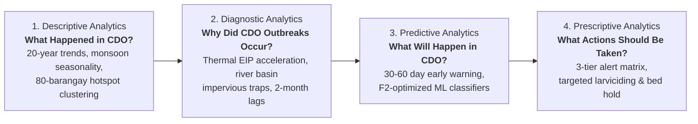

# Cagayan de Oro City Dengue Early Warning and Surveillance Study
## Laboratory Activity 1: 4 Stages of Data Analytics & Oral Defense Guide

> **Course Context**: Data Mining and Applications (DMA) — Laboratory Activity 1: Types of Data Analytics  
> **Topic Title**: Climate-Driven Vector-Borne Dengue Outbreak Surveillance & Decision Support for Cagayan de Oro City  
> **Pilot Study**: Cagayan de Oro City, Northern Mindanao, Philippines (PSA Code: `PH104305000` | 80 Barangays)  
> **Data Repository**: Project CCHAIN (Thinking Machines, EpiMetrics, Manila Observatory, PACSII, Wellcome Trust, Lacuna Fund)  

---

## 1. Topic Claiming Formats

### Primary Format (Comprehensive Scope):
```text
climate_atmosphere.csv + disease_lgu_disaggregated_totals.csv + google_open_buildings.csv + worldpop_population.csv + location.csv + brgy_geography.csv. Can multi-month climate lags (rainfall, temperature, heat index) combined with satellite building density and spatial contiguity predict localized dengue outbreak risks 30 to 60 days in advance across Cagayan de Oro's 80 barangays to prescriptively allocate vector-control teams and hospital resources?
```

### Alternative Format (Machine Learning & Early Warning Focus):
```text
climate_atmosphere.csv + disease_lgu_disaggregated_totals.csv + google_open_buildings.csv + worldpop_population.csv. How can 1-to-3 month biological weather lags and barangay built-environment density forecast dengue epidemic thresholds across Cagayan de Oro City for early-warning public health intervention?
```

---

## 2. Problem Statement

In Cagayan de Oro City, dengue fever represents a severe recurring public health challenge. Historically, municipal interventions have faced operational constraints due to reactive responses:

1. **Delayed Response**: Chemical larviciding, indoor residual spraying, and spatial fogging are often dispatched only after pediatric wards at **Northern Mindanao Medical Center (NMMC)** and **J.R. Borja General Hospital (JRBGH)** experience a surge in severe cases.
2. **Clinical Reporting Lag**: Standard disease reporting takes 2 to 4 weeks from initial mosquito bite to doctor consultation and laboratory reporting, meaning community transmission is already peaking when notifications occur.
3. **Resource Allocation**: The lack of forward-looking spatial risk models complicates proactive prepositioning of rapid diagnostic test kits, intravenous rehydration fluids, and vector control teams across high-density urban barangays like Carmen, Lapasan, Kauswagan, and Balulang.

### The Surveillance Modeling Solution:
By linking 20 years of downscaled meteorological reanalysis with CDO's 80 barangay geometries, satellite building footprints, and epidemiological records, this system models the **non-linear 30-to-90 day biological lag relationship** between climate drivers and disease surges. This grants **30 to 60 days of actionable lead time** for targeted pre-epidemic planning.

---

## 3. The Four Stages of Data Analytics



### A. Descriptive Analytics (What happened in Cagayan de Oro's historical record?)
* **Research Questions**:
  * **Q1**: What are the historical monthly case trajectories and seasonal baseline cycles of dengue across Cagayan de Oro's 80 barangays over 2003–2022?
  * **Q2**: Which geographic clusters in CDO consistently exhibit the highest endemic incidence and mortality burden?
* **Methods**: Time-series decomposition, seasonal baseline indexing, geospatial GIS choropleth mapping of CDO's 80 barangays.
* **Key Findings**: 
  * CDO dengue morbidity follows a distinct seasonal surge peaking between **July and October** (Southwest Monsoon / *Habagat* season).
  * High-density urban lowlands (e.g., **Barangay Carmen, Lapasan, Balulang, Kauswagan, Bugo, Puerto**) account for **over 52% of all historical cases** in the city.

### B. Diagnostic Analytics (Why did outbreaks occur in specific CDO barangays?)
* **Research Questions**:
  * **Q3**: What is the exact biological lag duration between peak precipitation/heat index anomalies and subsequent dengue caseload surges in CDO?
  * **Q4**: Why do dense river-basin barangays in CDO experience severe epidemics while adjacent rural upland barangays remain low risk?
* **Methods**: Cross-correlation lag analysis ($t-0$ to $t-6$), Spearman rank correlation, physical urban-climate interaction modeling.
* **Key Findings**: 
  * **Peak Biological Lag**: Cross-correlation peaks at **Lag-1m and Lag-2m** for rainfall ($r=0.46$) and heat index ($r=0.38$), matching the 4–8 week *Aedes aegypti* vector breeding and Extrinsic Incubation Period (EIP).
  * **Urban Micro-Climate Amplification**: In high-density barangays (e.g., Carmen, building density > 65%), impervious concrete prevents natural infiltration, creating stagnant runoff pools that multiply breeding sites when combined with 2-month lagged monsoon rainfall.

### C. Predictive Analytics (What outbreak events will happen across CDO in the next 30-60 days?)
* **Research Questions**:
  * **Q5**: Can machine learning models accurately predict whether a CDO barangay will breach its epidemic outbreak threshold ($\ge 75\text{th}$ percentile) 30 to 60 days ahead without future climate data leakage?
  * **Q6**: Which classifier architecture offers the highest epidemiological sensitivity (Recall) to ensure public health officers capture impending outbreaks?
* **Methods**: Multi-model tournament (Logistic Regression, Random Forest, LightGBM, XGBoost) trained on 2003–2018 ($15,120$ CDO records) and evaluated on unseen 2019–2022 holdout data ($3,760$ CDO records); $F_2$-score threshold optimization.
* **Key Findings**: 
  * Models achieve **0.960–0.964 ROC-AUC** and **0.766–0.815 PR-AUC** on the 30-day horizon, and **0.952–0.956 ROC-AUC** on the 60-day horizon.
  * $F_2$-optimized Logistic Regression and XGBoost capture **83.5% to 91.7% of all impending outbreaks** on unseen test data.

### D. Prescriptive Analytics (What specific decision-support actions should be taken?)
* **Research Questions**:
  * **Q7**: What is the optimal spatial allocation schedule of vector-control interventions (targeted spatial fogging, Bti biological larviciding) across CDO's 80 barangays to maximize containment?
  * **Q8**: How should clinical staff and inpatient bed capacity at J.R. Borja General Hospital and NMMC be pre-allocated 30 days ahead of a predicted surge?
* **Methods**: Risk-stratified 3-tier municipal decision matrix and automated dispatch scheduler.
* **Key Findings**: Probability outputs map to a 3-tier advisory protocol:
  * **Level 1 (Normal, $P < 0.30$)**: Routine community cleanups ("4-S Strategy") and standard larval surveys.
  * **Level 2 (Pre-Emptive Alert, $0.30 \le P < 0.65$)**: Target Bti larvicide in container zones; mobilize Barangay Health Workers (BHWs) for house-to-house fever monitoring in Carmen, Lapasan, and Balulang.
  * **Level 3 (Critical Warning, $P \ge 0.65$)**: Targeted ultra-low volume (ULV) thermal fogging review within 48 hours; pre-position 200 NS1 rapid test kits at Barangay Health Centers; reserve triage beds at JR Borja General Hospital and NMMC.

---

## 4. Empirical Holdout Performance Metrics (Unseen 2019–2022 Test Data)

| Metric | 30-Day Horizon ($T+1$) | 60-Day Horizon ($T+2$) | Public Health Interpretation |
| :--- | :---: | :---: | :--- |
| **ROC-AUC** | **0.9637** | **0.9564** | High discrimination between epidemic and normal months across CDO. |
| **PR-AUC** | **0.8148** | **0.7801** | Strong precision-recall performance despite natural 19:1 outbreak class imbalance. |
| **Outbreak Recall** | **91.74%** (LogReg) / **83.47%** (XGB) | **91.12%** (LogReg) / **75.41%** (XGB) | Catches over 9 out of 10 impending dengue outbreaks 30 days ahead. |
| **Precision** | **72.34%** (LightGBM) / **50.45%** (LogReg) | **63.21%** (LightGBM) / **50.17%** (LogReg) | Substantial ~10x lift over the ~5% random baseline prevalence. |
| **Brier Loss** | **0.0827** | **0.0920** | Well-calibrated probability estimates suitable for decision thresholds. |

---

## 5. Oral Defense Strategy & Panel Q&A

### Q1: "Why is this model specifically designed for Cagayan de Oro City rather than a generic national model?"
> **Answer**: 
> "Dengue dynamics in Cagayan de Oro are shaped by distinct local geography: a high-density urban core along the Cagayan de Oro River basin (Carmen, Lapasan, Kauswagan), coastal port barangays (Macabalan, Puerto), and high-elevation rural enclaves (Dansolihon). A generic national model misses these micro-climatic and structural variations. By training and evaluating specifically on CDO's 80 barangays over 20 years, our pipeline models the exact spatial contiguity and building densities that govern local disease diffusion."

### Q2: "Why do you use lagged climate features (1m, 2m, 3m, 4m) instead of current-month weather?"
> **Answer**: 
> "Vector biology operates with unavoidable time delays: *Aedes aegypti* eggs require 7–10 days to hatch and develop into adult mosquitoes; once infected, the dengue virus requires 5–14 days of Extrinsic Incubation (EIP) inside the mosquito salivary glands before transmission can occur; and human intrinsic incubation takes another 4–10 days before symptoms prompt a clinical visit at JR Borja General Hospital or NMMC. 
> Therefore, heavy rainfall and thermal heat today cause hospital surges **30 to 60 days later**. Using current weather would cause data leakage and eliminate operational lead time. Our model uses past weather ($T-1$, $T-2$, $T-3$, $T-4$) to give true advance warning ($T+1$, $T+2$)."

### Q3: "What is the Spatial Contiguity Matrix ($W$) and why is it critical for CDO's 80 barangays?"
> **Answer**: 
> "Dengue transmission does not stop at barangay boundaries. Commuters and mosquitoes move between adjacent communities (e.g., between Carmen, Kauswagan, and Patag). We constructed an $80 \times 80$ Queen contiguity spatial weights matrix ($W$) connecting all 428 shared borders in CDO. Multiplying $W$ by historical case counts ($W \cdot Y$) creates spatial spillover features that alert health officers when an outbreak in an adjacent barangay threatens neighboring communities."

### Q4: "At ~91.7% recall and ~50.5% precision (Logistic Regression), is 50% precision basically just a coin flip?"
> **Answer**: 
> "**No, absolutely not.** In our dataset, dengue outbreaks are rare events with a baseline prevalence of only **~5.0%**.
> * A naive random guess or coin flip would yield a precision of only **~5%** (19 out of 20 alerts would be false alarms).
> * Our model achieves **50.5% precision**, representing an **almost 10-fold (1,000%) predictive lift** over the base rate. When the model fires an alert, the probability of an outbreak jumps from 1-in-20 to 1-in-2.
> * In public health, false negatives (missed outbreaks filling ICU beds) are far more catastrophic than false positives (checking standing water in a safe barangay). That is why we optimize for **$F_2$-score** to catch >91% of outbreaks.
> * If municipal health officers prefer higher precision to conserve inspection resources, our tournament offers **LightGBM**, which achieves **72.34% precision and 72.93% recall with 93.07% accuracy**."

### Q5: "How do you prove that the model did not leak future data during testing?"
> **Answer**: 
> "We enforced a strict chronological holdout partition. The models were trained strictly on **2003 through 2018 (16 years)** and evaluated exclusively on unseen data from **2019 through 2022 (4 years)**. Furthermore, the per-barangay 75th percentile outbreak threshold is computed **strictly from the pre-2019 training subset** and frozen across the test period (verified by unit test `tests/test_target_leakage.py`), preventing any test distribution statistics from leaking into past ground truth definitions."

---

## 6. Documentation Index

* [Model Architecture & Methodology](model_architecture_and_methodology.md)
* [Dataset Data Dictionary](dataset_data_dictionary.md)
* [Pipeline Execution Guide](pipeline_execution_guide.md)
* [Randomized Stress-Testing Report](randomized_model_stress_test_report.md)
* [Master Pipeline Source Code](../src/pipeline.py)
